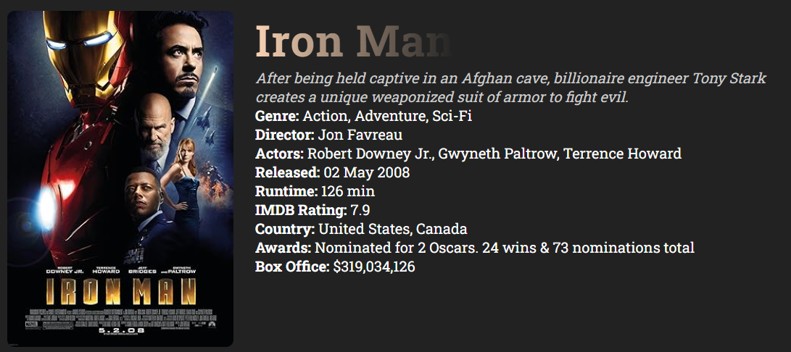

# React Movie Search App

A simple and modern React application to search for movies using the [OMDb API](https://www.omdbapi.com/). Browse movies, view details, and enjoy a clean, responsive UI.

## Features
- 🔍 Search for movies by title
- 🎬 View detailed information for each movie
- 🖼️ Clickable movie posters
- 🛣️ Routing with React Router (deep linking to movie detail pages)
- ⚡ Fast and responsive design

## Demo


## Getting Started

### Prerequisites
- [Node.js](https://nodejs.org/) (v14 or higher recommended)
- npm (comes with Node.js)

### Installation
1. **Clone the repository:**
   ```bash
   git clone https://github.com/Abubeker01/Search_Project.git
   cd Search_Project
   ```
2. **Install dependencies:**
   ```bash
   npm install
   ```
3. **Get an OMDb API key:**
   - Sign up for a free API key at [OMDb API](https://www.omdbapi.com/apikey.aspx)
4. **Create a `.env` file in the project root:**
   ```env
   REACT_APP_MOVIES_API_URL=https://www.omdbapi.com/?apikey=YOUR_API_KEY
   ```
   Replace `YOUR_API_KEY` with your actual OMDb API key.
5. **Start the development server:**
   ```bash
   npm start
   ```
   The app will open at [http://localhost:3000](http://localhost:3000)

## Usage
- Type a movie title in the search bar and press Enter or click the search icon.
- Click on any movie poster to view detailed information about the movie.
- Use the browser's back button to return to the search results.

## Dependencies
- React
- react-router-dom
